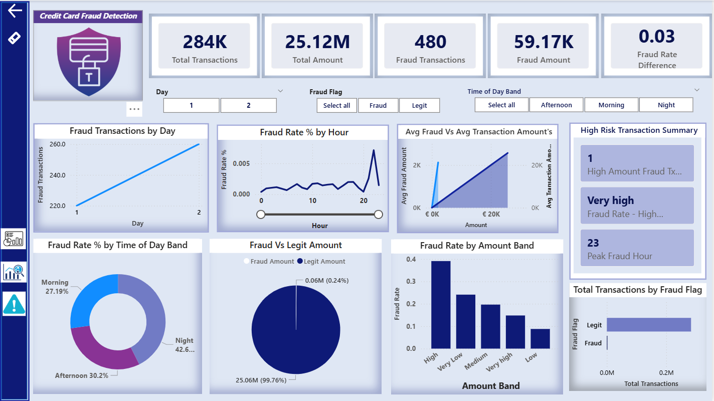
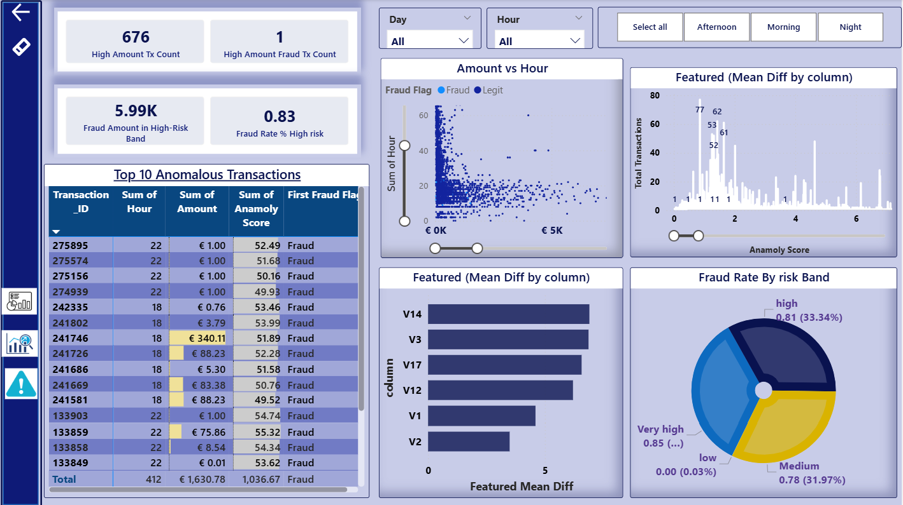

# Credit Card Fraud Detection Dashboard

## 📌 Domain
BFSI (Banking, Financial Services, and Insurance)

---

## Overview
This project looks at credit card transaction data to understand how fraud behaves and how analysts can spot risky activity more efficiently.  
Instead of treating all transactions the same, the dashboard focuses on **when fraud is more likely to happen** and **which transactions need immediate attention**, especially in a dataset where fraud cases are very rare.

---

## Business Objective
- Identify fraudulent transactions in a highly imbalanced dataset  
- Group transactions by risk level to make reviews faster and more focused  
- Help analysts concentrate on a small set of high-risk transactions instead of scanning all activity  

---

## Dataset
- Source: Kaggle – Credit Card Fraud Detection  
- Transactions: ~284,000  
- Fraud Rate: ~0.17%  
- Columns include PCA features (V1–V28), Time, Amount, and Class  

---

## Key Metrics
- Total Transactions  
- Fraud Transactions  
- Fraud Rate (%)  
- Fraud Amount  
- High-Risk and Very-High-Risk Transaction Count  
- Average Risk / Anomaly Score  

---

## Analysis Performed
- Compared patterns between fraud and non-fraud transactions  
- Segmented transactions into risk bands (Low to Very High)  
- Analyzed fraud trends by hour and time of day  
- Reviewed anomaly score distributions to see how well fraud stands out  
- Checked which features show noticeable differences for fraudulent activity  

---

## Key Insights
- Fraud makes up a very small portion of total transactions, but these cases consistently show much higher risk scores, making risk-based filtering effective even with heavily imbalanced data.  
- Most fraud activity happens during late-night and early-morning hours (around 12:00 AM to 5:00 AM), when transaction monitoring is usually lighter.  
- A small number of very high-risk transactions account for a large share of the total fraud amount, making them the most important cases to review first.  
- Fraudulent transactions follow clear behavioral patterns rather than occurring randomly, which makes them easier to flag when the right indicators are tracked.  
- Segmenting transactions by risk level helps reduce analyst effort by narrowing investigations to the most impactful cases.

---

## Dashboards
- Executive Fraud Overview  
- Fraud Pattern & Driver Analysis  
- Transaction Monitoring & Investigation  

---

## Tools & Technology
- Power BI (DAX, data modeling, drill-through)  
- SQL (aggregation and validation)  
- Excel (data checks)  

---

## Outcome
- Highlighted time windows and transaction patterns where fraud is more likely to occur  
- Helped prioritize which transactions should be reviewed first  
- Created dashboards that can be used daily to track fraud trends and risk levels  

---
## 📷 Dashboard Preview

<table align="center">
  <tr>
    <td align="center">
       
      <strong>Executive Fraud Overview</strong>
    </td>
    <td align="center">
       
      <strong>Fraud Pattern & Driver Analysis</strong>
    </td>
  </tr>
</table>

----
## PBIX Availability
The PBIX file for this dashboard exceeds GitHub’s file size limits. 
A PDF export and screenshots are provided for review. 
The PBIX file can be shared upon request.

