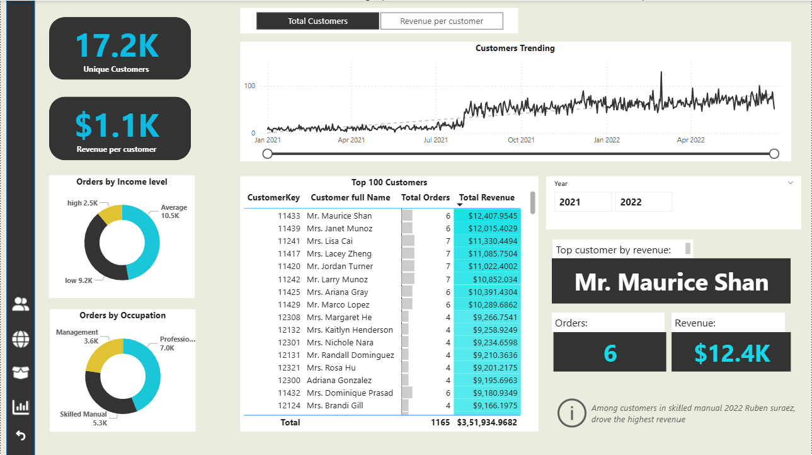

# Ecommerce Sales, Profit & Customer Analysis

## 📌 Domain
Ecommerce / Retail Analytics

## Overview
This project analyzes ecommerce sales data to track revenue growth, profitability, customer behavior, product performance, and returns using interactive Power BI dashboards.

## Business Objective
- Track revenue, profit, orders, and return trends
- Identify top-performing products and categories
- Understand customer value and purchase behavior
- Analyze regional sales distribution
- Monitor returns and profit impact

## Dataset
- Type: Ecommerce transactional data
- Data Includes: Orders, revenue, profit, returns, products, customers, regions, time
- Time Period: Multiple years of historical sales data

## Key Metrics
- Total Revenue
- Total Profit
- Total Orders
- Return Rate
- Revenue per Customer
- Monthly and Weekly Revenue
- Orders by Category and Product

## Analysis Performed
- Revenue and profit trend analysis
- Product-level performance and return analysis
- Customer segmentation and top customer analysis
- Regional sales distribution using maps
- Category-wise contribution to orders and revenue

## Key Insights
- Revenue shows strong growth over time with seasonal fluctuations.
- A small set of products contributes a large share of total revenue.
- Certain categories have higher return rates impacting profitability.
- High-value customers drive disproportionate revenue.
- Regional sales concentration highlights key growth markets.

## Dashboards
- Executive Overview
- Regional Sales Analysis
- Product Performance
- Customer Insights
- Category Analysis

## Tools Used
- Power BI (DAX, data modeling, interactive visuals)

## Outcome
- Built an end-to-end ecommerce analytics dashboard
- Identified revenue drivers, profit gaps, and return risks
- Enabled business-focused insights for sales and product decisions

## Dashboard Preview
    
</table>
<table align="center">
  <tr>
    <td align="center">
       
      <strong>Executive Overview</strong>
    </td>
    <td align="center">
       
      <strong>Customer Insights</strong>
    </td>
  </tr>
</table>
