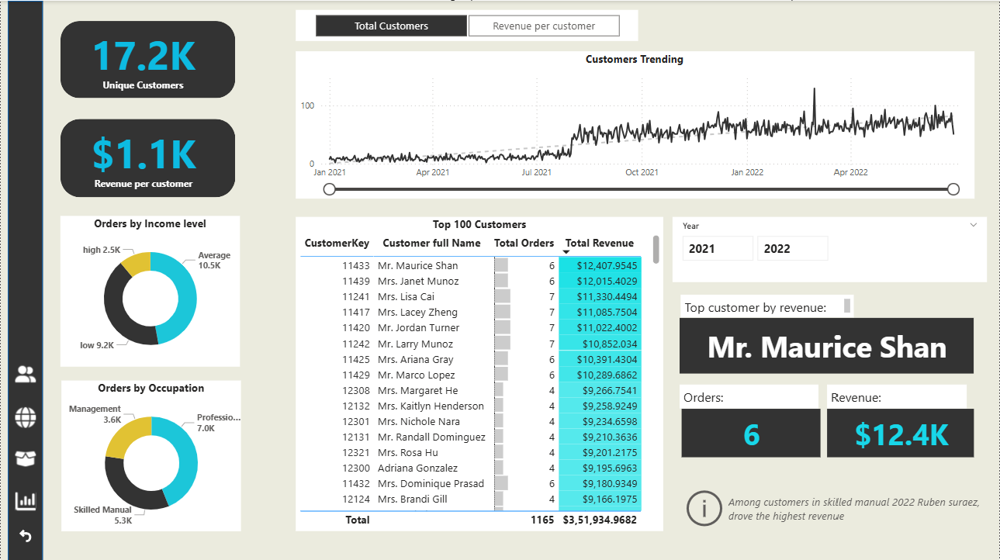

# Ecommerce Sales, Profit & Customer Analysis

## 📌 Domain
Ecommerce / Retail Analytics

---

## Overview
This project analyzes ecommerce sales data to understand how revenue, profit, and customer behavior evolve over time.  
The focus is on identifying **what actually drives growth**, where profitability is being impacted by returns, and which products and customers contribute the most value, rather than looking at sales numbers in isolation.

---

## Business Objective
- Track revenue, profit, orders, and returns to understand overall business performance  
- Identify products and categories that drive the majority of revenue and profit  
- Understand customer value and repeat purchase behavior  
- Analyze regional sales distribution to highlight key markets  
- Assess how returns affect profitability across categories  

---

## Dataset
- Type: Ecommerce transactional data  
- Includes: Orders, revenue, profit, returns, products, customers, regions, and time  
- Time Period: Multiple years of historical sales data  

---

## Key Metrics
- Total Revenue  
- Total Profit  
- Total Orders  
- Return Rate  
- Revenue per Customer  
- Monthly and Weekly Revenue Trends  
- Orders by Category and Product  

---

## Analysis Performed
- Analyzed revenue and profit trends over time to understand growth patterns and seasonality  
- Evaluated product-level performance to identify top contributors and underperformers  
- Reviewed return rates by product and category to assess profit impact  
- Segmented customers to identify high-value customers and repeat purchase behavior  
- Analyzed regional sales distribution to highlight strong and emerging markets  

---

## Key Insights
- Revenue shows steady growth over time, with clear seasonal patterns that can be used for demand planning and promotions.  
- A relatively small set of products contributes a large share of total revenue, indicating strong product concentration rather than evenly distributed sales.  
- Certain categories experience higher return rates, which directly impacts overall profitability despite strong sales volumes.  
- High-value customers contribute a disproportionate share of revenue, making customer retention more impactful than broad acquisition efforts.  
- Regional sales are concentrated in specific markets, highlighting areas with higher growth potential and regions that may require targeted strategies.  

---

## Dashboards
- Executive Overview  
- Regional Sales Analysis  
- Product Performance  
- Customer Insights  
- Category Analysis  

---

## Tools Used
- Power BI (DAX, data modeling, interactive visuals)

---

## Outcome
- Provided a consolidated view of ecommerce performance across sales, profit, customers, and products  
- Highlighted key revenue drivers and areas where returns reduce profitability  
- Enabled data-backed discussions around product focus, customer retention, and regional growth opportunities  

---

## Dashboard Preview
    
</table>
<table align="center">
  <tr>
    <td align="center">
       
      <strong>Executive Overview</strong>
    </td>
    <td align="center">
       
      <strong>Customer Insights</strong>
    </td>
  </tr>
</table>

---

## PBIX Availability
The PBIX file is provided in compressed (ZIP) format due to repository size constraints.
