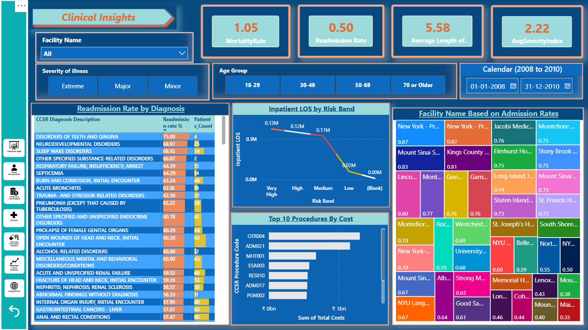
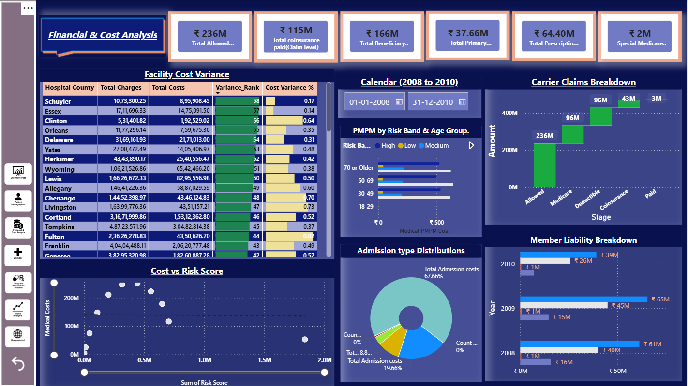

# Healthcare Cost, Risk & Outcomes Dashboard

## 📌 Domain
Healthcare Analytics

## Overview
This project analyzes Medicare beneficiary data to understand healthcare costs, patient risk, hospital utilization, and clinical outcomes using interactive dashboards.

## Business Objective
- Identify high-cost and high-risk patient groups  
- Analyze readmissions, length of stay, and mortality trends  
- Compare cost differences across hospitals and regions  
- Support data-driven decisions to improve care quality and cost efficiency  

## Dataset
- Source: CMS DE-SynPUF (Sample 0)
- Type: Synthetic Medicare claims data
- Time Period: 2008–2010
- Data Includes: Patients, admissions, diagnoses, procedures, costs, prescriptions, facilities

## Key Metrics
- Average Length of Stay (LOS)
- Readmission Rate
- Mortality Rate
- Average Quality Score
- Total Medical Cost
- Risk Score (Low to Very High)
- Prescription Cost and Utilization

## Analysis Performed
- Compared cost and outcomes across patient risk levels  
- Analyzed readmission and LOS trends by age and risk group  
- Identified diagnoses and procedures driving high costs  
- Compared cost variation across hospitals  
- Analyzed prescription usage and supply days  
- Mapped cost and risk by geographic location  

## Key Insights
- High and very high risk patients account for a large share of total medical cost and longer hospital stays.
- Readmission rates increase steadily as patient risk increases.
- A small set of diagnoses and procedures drives most healthcare spending.
- Noticeable cost differences exist between hospitals for similar patient risk levels.
- Older patients have higher prescription usage and longer treatment duration.
- Certain regions show consistently higher cost and risk levels.

## Dashboards
- Executive Summary
- Patient Demogarphics & Risk Stratification  
- Financial and Cost Analysis
- Clinical & Quality Metrics
- Drug Utilization & Prescription Analysis
- Trend Anlaysis
- Geographical Insights

## Tools Used
- Power BI (DAX, data modeling)
- SQL (aggregation & validation)
- Excel (data checks and validation)

## Outcome
- Built an end-to-end healthcare analytics dashboard
- Identified key cost and risk drivers affecting outcomes
- Enabled focused analysis for cost control and care improvement

## Dashboard Preview
</table>
<table align="center">
  <tr>
    <td align="center">
       
      <strong>Executive Overview</strong>
    </td>
    <td align="center">
       
      <strong>ClinicalMetrics</strong>
    </td>
      <td align="center">
       
      <strong>FinancialAnalysis</strong>
  </tr>
</table>

## PBIX Availability
The PBIX file for this dashboard exceeds GitHub’s file size limits. 
A PDF export and screenshots are provided for review. 
The PBIX file can be shared upon request.
