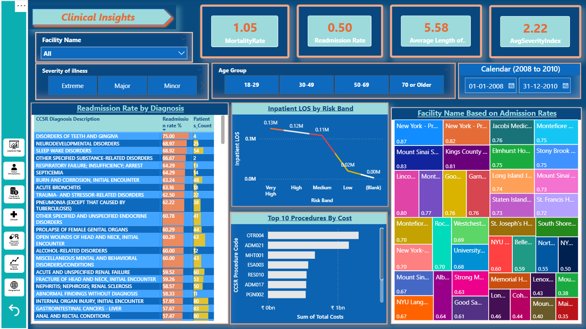
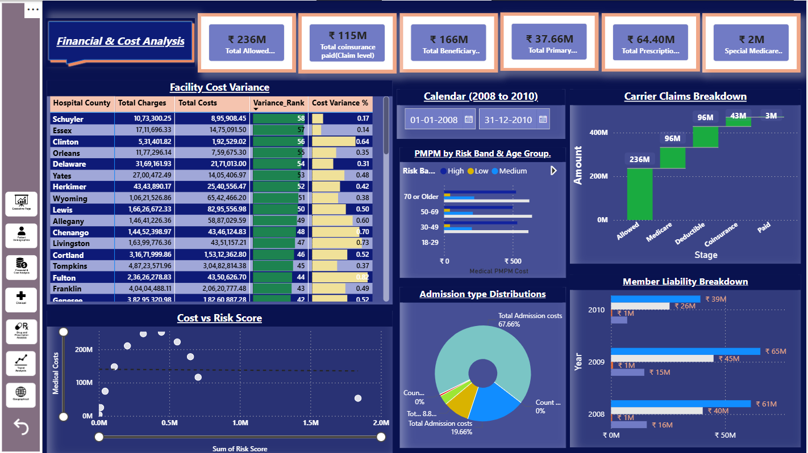

# Healthcare Cost, Risk & Outcomes Dashboard

## 📌 Domain
Healthcare Analytics

---

## Overview
This project analyzes Medicare beneficiary data to understand how **patient risk, hospital utilization, and treatment patterns influence healthcare costs and outcomes**.  
The focus is on identifying which patient groups drive higher costs, where outcomes vary, and how care utilization differs across hospitals and regions.

---

## Business Objective
- Identify patient groups with higher medical cost and clinical risk  
- Analyze readmissions, length of stay, and mortality patterns  
- Compare cost variation across hospitals and regions for similar patient profiles  
- Support analysis aimed at improving care quality while controlling costs  

---

## Dataset
- Source: CMS DE-SynPUF (Sample 0)  
- Type: Synthetic Medicare claims data  
- Time Period: 2008–2010  
- Includes: Patients, admissions, diagnoses, procedures, costs, prescriptions, and facilities  

---

## Key Metrics
- Average Length of Stay (LOS)  
- Readmission Rate  
- Mortality Rate  
- Average Quality Score  
- Total Medical Cost  
- Patient Risk Level (Low to Very High)  
- Prescription Cost and Utilization  

---

## Analysis Performed
- Compared healthcare cost and outcomes across patient risk levels  
- Analyzed readmission and length-of-stay trends by age group and risk category  
- Identified diagnoses and procedures that contribute most to overall cost  
- Compared cost variation across hospitals for similar patient risk profiles  
- Reviewed prescription usage and treatment duration across age groups  
- Mapped cost and patient risk distribution by geographic region  

---

## Key Insights
- High and very high risk patients account for a disproportionately large share of total medical cost and longer hospital stays.  
- Readmission rates increase steadily with patient risk, indicating higher care complexity and follow-up needs.  
- A relatively small set of diagnoses and procedures drives a significant portion of overall healthcare spending.  
- Noticeable cost variation exists across hospitals for patients with similar risk levels, suggesting differences in care practices or efficiency.  
- Older patients show higher prescription usage and longer treatment duration, contributing to higher overall cost.  
- Certain regions consistently exhibit higher patient risk and medical cost compared to others.  

---

## Dashboards
- Executive Summary  
- Patient Demographics & Risk Stratification  
- Financial and Cost Analysis  
- Clinical & Quality Metrics  
- Drug Utilization & Prescription Analysis  
- Trend Analysis  
- Geographical Insights  

---

## Tools Used
- Power BI (DAX, data modeling)  
- SQL (aggregation and validation)  
- Excel (data checks and validation)  

---

## Outcome
- Built an end-to-end healthcare analytics dashboard covering cost, risk, and outcomes  
- Highlighted patient groups and treatment areas driving higher cost and utilization  
- Enabled focused analysis to support cost control and care improvement discussions  

---

## 📷 Dashboard Preview
</table>
<table align="center">
  <tr>
    <td align="center">
       
      <strong>Executive Overview</strong>
    </td>
    <td align="center">
       
      <strong>ClinicalMetrics</strong>
    </td>
      <td align="center">
       
      <strong>FinancialAnalysis</strong>
  </tr>
</table>

---

## PBIX Availability
The PBIX file for this dashboard exceeds GitHub’s file size limits. 
A PDF export and screenshots are provided for review. 
The PBIX file can be shared upon request.
