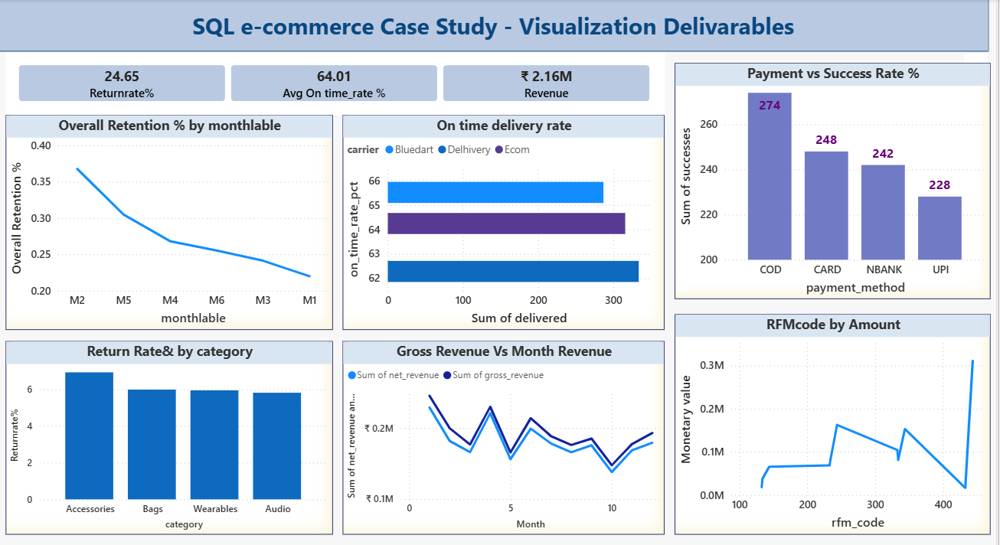

# SQL E-Commerce Mini Project

## 📌 Overview
This project demonstrates how SQL and Power BI can be used together to generate data-driven insights for an e-commerce business. 
It covers end-to-end steps from creating a small SQLite database and running analytical SQL queries to building a one -page Power Bi Dashboard.
--**The goal is to showcase SQL proficiency, analytical thinking, and BI integration for a Data Analyst role.

---

## 🛠 Tech Stack
- **Database:** SQLite
- **Tooling:** DBeaver for SQL execution
- **Visualization:** Power BI
- **SQL Features:** Joins, CTEs, Window Functions, Aggregations, Views, Indexes

---

## 🚀 How to Run

1. **Set up SQLite database in DBeaver**
   - Create a new SQLite connection and enable foreign keys:
     ```sql
     PRAGMA foreign_keys = ON;
     ```
2. **Execute scripts in order**
   - `01_schema.sql` → Create tables and constraints
   - `02_seed_data.sql` → Insert synthetic data
   - `03_views.sql` → Create analytical views
   - `04_analytics.sql` → Run business queries
   - `05_quality_checks.sql` → Validate data integrity
3. **Export query results**
   - Right-click result grid → Export as CSV
4. **Load into Power BI**
   - Import CSV files → Create visuals → Arrange dashboard
5. **Take screenshot**
   - Save as `assets/screenshots/dashboard.png`

---

## 📊 Dashboard
!Power BI Dashboard
The dashboard presents visuals derived directly from SQL outputs

### **Top KPIs**
- **Return Rate:** 24.65%
- **Average On-Time Delivery:** 64.01%
- **Total Revenue:** ₹2.16M

---

## 🔍 Key Insights
1. **Customer Retention**
   - Retention drops from ~35% in Month 2 to ~20% by Month 6.
   - ✅ Action: Launch loyalty programs to improve repeat purchases.

2. **On-Time Delivery**
   - Average SLA compliance: **64.01%**.
   - Bluedart leads with highest on-time rate 
   -✅ Action: Carrier needs Optimization.

3. **Payment Success**
   - COD has highest success count (274), UPI lowest (228).
   - ✅ Action: Promote UPI for faster, cost-effective payments.

4. **Returns**
   - Accessories category has highest return rate (~6%).
   - ✅ Action: Improve product descriptions and quality checks.

5. **Revenue Trend**
   - Net revenue fluctuates, peaks in Month 1 and Month 8.
   - ✅ Action: Plan seasonal campaigns around peak months.

6. **RFM Analysis**
   - High-value customers (RFM 444) contribute major revenue.
   - ✅ Action: Target with loyalty offers and personalized marketing.

(Screenshot available in assets/screenshots/dashboard.png)

---

## ✅ Next Steps
- Build a **Power BI dashboard** with drill-through and slicers.
- Scale project to **PostgreSQL** with partitions, materialized views, and query optimization.
- Add **EXPLAIN QUERY PLAN** screenshots for performance tuning.

---

## 📌 Why This Project?
This Project was developed to showcase:
- The ability to design a compact analytical database.
- Write performant SQL to extract business metrics.
- Translate query outputs into actionable visuals.
- Present insights clearly - the key expectation for a Data Analyst or Business intelligence role.

This project demonstrates the ability to use SQL & power BI together to extract insights and communicate data clearly.
---
## Dashboard Preview

<p align="center">
  
</p>


