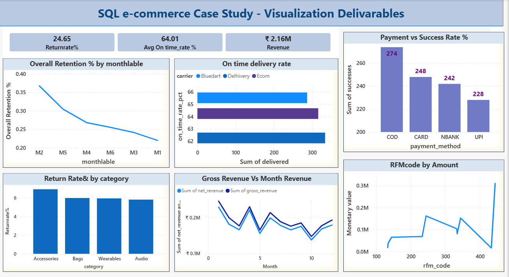

# SQL E-Commerce Analytics – Revenue, Retention & Operations

## 📌 Overview
This project demonstrates how **SQL can be used as the primary analytical engine** to understand revenue, customer behavior, returns, and operational performance in an e-commerce business.

The focus is on answering **business questions directly in SQL**, validating results, and then using Power BI only as a visualization layer.  
The project reflects how analytics work is typically done in real environments, where SQL drives insight and BI supports communication.

---

## 🛠 Tech Stack
- **Database:** SQLite  
- **SQL Execution:** DBeaver  
- **Visualization:** Power BI  
- **SQL Techniques Used:** Joins, CTEs, Window Functions, Aggregations, Views, Indexes  

---

## 📂 Data Model
- Customers  
- Orders  
- Order Items  
- Payments  
- Shipments  
- Returns  

The dataset was designed to simulate realistic e-commerce operations, including delivery delays, returns, and payment behavior.

---

## 📊 Key Business Metrics
- **Total Revenue:** ₹2.16M  
- **Return Rate:** 24.65%  
- **On-Time Delivery Rate:** 64.01%  
- **Customer Retention (Month 6):** ~20%  
- **High-Value Customer Segment (RFM 444):** Major revenue contributor  

---

## 🔍 Analysis Performed (SQL-Driven)
- Revenue and order trends over time  
- Customer retention and repeat purchase analysis  
- On-time delivery performance and carrier comparison  
- Payment method success analysis (COD vs UPI vs others)  
- Category-wise return rate analysis  
- RFM segmentation to identify high-value customers  

All metrics and insights were derived directly from SQL queries, with validation steps to ensure data consistency.

---

## 💡 Key Insights
- Customer retention drops sharply after the first few months, indicating onboarding and early experience as critical drivers of repeat purchases.  
- Overall SLA compliance is low (~64%), with noticeable performance differences between logistics partners, directly impacting customer experience.  
- COD shows higher success volume, while UPI adoption is lower despite operational advantages, suggesting an opportunity for payment optimization.  
- Certain categories (e.g., accessories) show disproportionately higher return rates, increasing reverse logistics cost.  
- A small segment of high-value customers contributes a large share of total revenue, highlighting concentration risk as well as retention opportunity.  

---

## 📊 Dashboard
A one-page Power BI dashboard was built using SQL outputs to summarize:
- Revenue and returns  
- Retention behavior  
- Delivery performance  
- Customer segmentation  

*(Dashboard screenshot available in the repository)*

---

## 🎯 Outcome
This project demonstrates the ability to:
- Use SQL as the primary tool for business analysis  
- Translate raw transactional data into meaningful metrics  
- Connect customer behavior, operations, and revenue outcomes  
- Communicate insights clearly through focused visual summaries  

This reflects the type of SQL-driven analytics expected in **Data Analyst / Business Intelligence** roles.

---

## Dashboard Preview

  

---

## 📌 PBIX Availability
The Power BI file is provided in compressed (ZIP) format due to repository size constraints.

